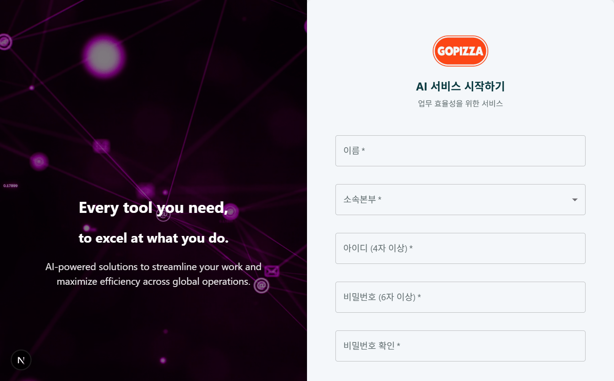
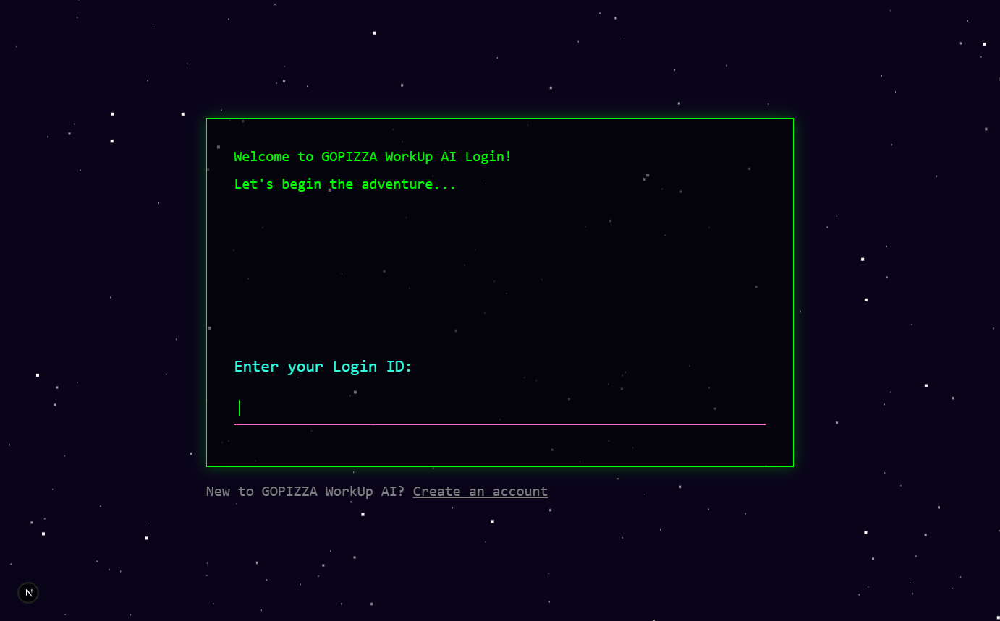
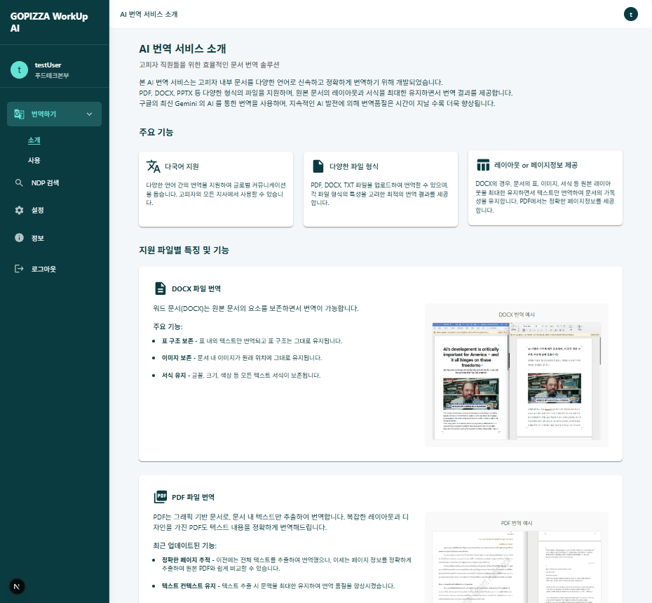
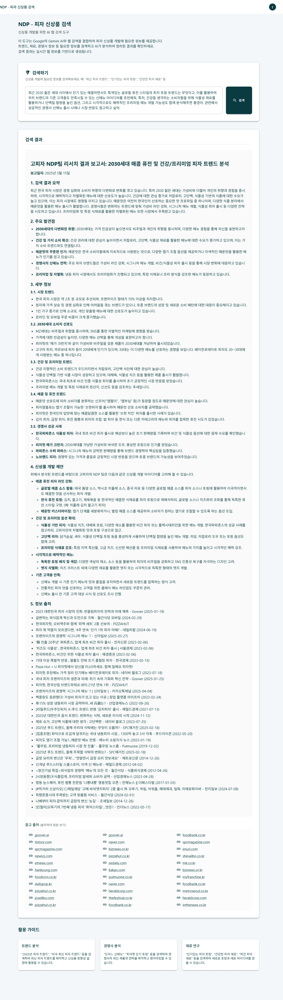

<div align="center">

# 🍕 GopizzaWorkAi - 고피자 AI 업무 지원 시스템

## 회원가입

 <br>

## 로그인

 <br>

## AI 다국어 번역기

 <br>

## New Product Development

 `

</div>

## 📋 프로젝트 개요

1. GopizzaWorkAi는 고피자 사내 업무 효율화를 위해 개발된 **AI 기반 LLM 업무 지원 플랫폼**입니다. 글로벌 비즈니스 확장에 맞춰 다국어 환경에서의 원활한 의사소통을 지원하기 위해 7개국 이상의 100장이상의 문서 단위를 최신의 Gemini LLM 모델을 활용하여 자연스럽고 유창한 번역을 지원합니다. <br><br>
2. 신상품 개발(NPD) 업무에서는 Gemini의 고도화된 웹 검색 기능(Grounding with Google Search)과 LLM의 강력한 이해 및 요약 능력을 결합하여, 사용자가 긴 문장의 자연어 질문으로도 원하는 정보를 정확하고 빠르게 찾고 핵심 내용을 파악할 수 있도록 지원합니다.<br><br> GopizzaWorkAi는 이처럼 다각적인 접근을 통해 업무 효율성을 극대화하고 생산성 향상에 기여하는 것을 목표로 합니다. 현재는 초기 단계여서 위의 2가지 기능만을 지원하고 있습니다.

## 🛠️ 기술 스택

<b>🧠 AI & LLM</b>
<br>

- **LLM 엔진**: Google Generative AI (Gemini)
- **사용 모델**: gemini-2.5-flash-preview-04-17

<b>🖥️ 백엔드</b>
<br>

- **서버**: Next.js API Routes
- **데이터베이스**: Supabase (PostgreSQL)
- **ORM**: Prisma 6.5.0
- **인증**: NextAuth.js 4.24.11

<b>💻 프론트엔드</b>
<br>

- **프레임워크**: Next.js 15.2.3, React 19
- **언어**: TypeScript
- **UI 라이브러리**: Material UI 6.4.8, Emotion
- **상태 관리**: MobX
- **폼 관리**: React Hook Form
- **마크다운 렌더링**: React Markdown, remark-gfm
- **알림**: React Toastify

<b>📄 문서 처리</b>
<br>

- **PDF 처리**: pdf-parse, pdfjs-dist, @react-pdf/renderer
- **DOCX 처리**: mammoth, docx, html-docx-js
- **이미지 처리**: Sharp, Canvas

<b>☁️ 인프라</b>
<br>

- **배포**: Vercel
- **스토리지**: Vercel Blob Storage
- **데이터베이스 호스팅**: Supabase Cloud

## ✨ 주요 기능

### 🔍 신상품 개발(NPD) 검색 엔진

- **Gemini LLM의 심층적 이해 및 정보 가공**: 최신 Gemini LLM은 사용자의 복잡하고 긴 질문 의도를 정확히 파악할 뿐만 아니라, 검색된 방대한 정보를 심층적으로 이해하고 핵심 내용을 요약·정리하여 사용자가 원하는 맞춤형 정보를 명확하게 전달합니다.<br><br>
- **실시간 Google Search 연동 및 최신 정보 확보**: 'Grounding with Google Search' 기능을 통해 웹상의 최신 트렌드, 데이터 및 (필요시 이미지에 대한 분석 및 이해를 통한 멀티모달 정보 포함) 자료를 실시간으로 탐색하고 분석하여 가장 정확하고 시의성 있는 정보를 제공합니다.<br><br>
- **투명한 정보 출처 제시**: 검색된 모든 정보에 대해 명확한 원본 출처를 제공하여 결과의 신뢰도를 높이고, 사용자의 심층적인 검토 및 검증을 지원합니다.<br><br>
- **구조화된 결과 및 NPD 업무 활용 극대화**: 검색 결과를 가독성 높은 마크다운 형식으로 제공하며, 이를 통해 최신 시장 트렌드 분석, 경쟁사 동향 파악, 신규 재료 연구 등 신상품 개발(NPD) 핵심 업무의 효율성을 극대화합니다.

### 📝 AI 다국어 번역기

- **대용량 및 고품질 번역** ChatGPT나 Gemini와 같은 일반적인 웹 LLM 서비스 사용시 주로 수십 줄의 짧은 텍스트 처리에 초점을 맞추는 반면, 본 플랫폼은 100페이지 이상의 방대한 문서도 Gemini LLM을 통해 통째로 번역합니다. 단순 기계 번역을 넘어, 문맥을 깊이 이해하는 Gemini의 능력으로 자연스럽고 정확도 높은 번역 품질을 제공하여, 마치 전문 번역가가 작업한 듯한 결과물을 통해 원활한 글로벌 커뮤니케이션을 지원합니다.<br><br>
- **다양한 문서 형식 지원**: PDF, DOCX, TXT 등 주요 업무용 문서 형식을 폭넓게 지원하여 변환 과정의 번거로움을 최소화합니다.<br><br>
- **원본 레이아웃 보존**: 번역 과정에서 원본 문서의 서식, 이미지, 표 등의 레이아웃을 최대한 유지하여 가독성을 높입니다.<br><br>
- **다국어 지원**: 영어, 일본어, 중국어, 인도어, 태국어, 베트남어, 필리핀어를 포함한 진출국들에 대한 언어들을 지원하고 추후에도 수십개의 추가적인 언어를 빠르게 지원할 수 있음으로 하여, 비즈니스 언어 간의 양방향 번역을 지원하여 글로벌 협업을 강화합니다.

### 🔐 사용자 관리 시스템

- **사용자 인증**: NextAuth.js를 활용한 안전한 로그인 및 인증 시스템
- **권한 관리**: 관리자 및 일반 사용자 권한 구분
- **사용량 모니터링**: 사용자별 기능 사용량 추적 및 관리

### 📊 관리자 대시보드

- **사용 통계**: 서비스 사용 현황 통계 제공
- **API 키 관리**: Google Gemini API 및 외부 서비스 연동을 위한 API 키 관리
- **사용자 관리**: 시스템 사용자 계정 관리

## 📂 프로젝트 구조

```
GopizzaWorkAi/
├── components/           # 재사용 가능한 UI 컴포넌트
│   ├── common/           # 공통 컴포넌트
│   ├── layout/           # 레이아웃 컴포넌트
│   └── npd/              # 신상품 개발 관련 컴포넌트
├── docs/                 # 문서화
├── hooks/                # 커스텀 React 훅
├── lib/                  # 유틸리티 함수 및 공통 로직
│   ├── ai/               # AI 관련 로직
│   ├── auth/             # 인증 관련 로직
│   └── db/               # 데이터베이스 관련 로직
├── pages/                # 페이지 컴포넌트 및 API 라우트
│   ├── admin/            # 관리자 페이지
│   ├── ai-translate/     # 번역 관련 페이지
│   ├── npd/              # 신상품 개발 검색 페이지
│   ├── api/              # API 엔드포인트
│       ├── admin/        # 관리자 API
│       ├── auth/         # 인증 관련 API
│       ├── npd/          # 신상품 개발 검색 API
│       ├── translate/    # 번역 관련 API
│       ├── usage/        # 사용량 추적 API
│       └── user/         # 사용자 관리 API
├── prisma/               # Prisma 스키마 및 마이그레이션
├── public/               # 정적 파일
├── stores/               # MobX 상태 저장소
├── styles/               # 글로벌 스타일
├── types/                # 타입 정의
└── utils/                # 유틸리티 함수
```

## 💾 데이터베이스 구성

<div align="center">


</div>

본 프로젝트는 Supabase를 데이터베이스로 활용하고 있습니다. Prisma ORM을 통해 타입 안전한 데이터 액세스를 구현했습니다.

### Supabase 활용

- **PostgreSQL 데이터베이스**: 강력한 관계형 데이터베이스 기능 활용

### Prisma 활용

- **타입 안전성**: TypeScript와 완벽하게 통합된 타입 안전한 데이터 접근
- **자동 마이그레이션**: 스키마 변경 사항을 자동으로 데이터베이스에 적용
- **쿼리 빌더**: 직관적이고 강력한 데이터베이스 쿼리 빌더 제공

## 🚀 설치 및 실행 방법

### 필요 조건

- Node.js 18.0 이상
- npm 또는 Yarn 패키지 매니저
- Supabase 계정 및 프로젝트
- Google AI API 키 (Gemini 모델 접근 권한 필요)

### 설치

```bash
# 저장소 복제
git clone https://github.com/gopizza/GopizzaWorkAi.git
cd GopizzaWorkAi

# 의존성 설치
npm install
# 또는
yarn install
```

### 환경 변수 설정

`.env.local` 파일을 생성하고 다음 변수들을 설정합니다:

```env
# 기본 설정
NEXT_PUBLIC_APP_URL=http://localhost:3000

# Supabase 설정
NEXT_PUBLIC_SUPABASE_URL=your_supabase_url
NEXT_PUBLIC_SUPABASE_ANON_KEY=your_supabase_anon_key
SUPABASE_SERVICE_ROLE_KEY=your_supabase_service_role_key

# NextAuth 설정
NEXTAUTH_URL=http://localhost:3000
NEXTAUTH_SECRET=your_nextauth_secret

# Google AI API 키
GOOGLE_AI_API_KEY=your_google_ai_api_key
GOOGLE_AI_MODEL=gemini-2.5-flash-preview-04-17
```

### 데이터베이스 설정

```bash
# Prisma 클라이언트 생성
npx prisma generate

# 데이터베이스 마이그레이션 (필요한 경우)
npx prisma migrate dev
```

### 개발 서버 실행

```bash
npm run dev
# 또는
yarn dev
```

브라우저에서 [http://localhost:3000](http://localhost:3000)에 접속하여 애플리케이션을 확인할 수 있습니다.

### 프로덕션 빌드

```bash
npm run build
npm run start
# 또는
yarn build
yarn start
```

## 💡 유의사항 및 문제 해결

### 알려진 이슈

- **Prisma 초기화 오류**: 프로젝트 실행 시 Prisma 초기화 오류가 발생할 수 있습니다. 이는 `.env` 또는 `.env.local` 파일에 데이터베이스 연결 정보가 올바르게 설정되지 않은 경우 발생합니다. `DATABASE_URL` 환경 변수가 올바르게 설정되어 있는지 확인하세요.

- **NextAuth URL 설정**: 로컬 개발 환경에서 인증 관련 문제가 발생하는 경우, `.env.local` 파일의 `NEXTAUTH_URL`이 `http://localhost:3000`으로 정확히 설정되어 있는지 확인하세요.

- **Gemini API 모델명**: Google Generative AI API 사용 시 모델명 'gemini-2.5-flash-preview-04-17'을 사용합니다. API 응답 오류 발생 시 모델명이 올바르게 설정되어 있는지 확인하세요.

### 배포 시 주의사항

- **환경 변수**: 프로덕션 환경에 배포할 때는 모든 환경 변수가 제대로 설정되어 있어야 합니다.
- **빌드 프로세스**: `build.js` 스크립트는 Vercel 배포 시 필요한 사전 작업을 수행합니다.
- **Prisma 생성**: 배포 전 반드시 `prisma generate` 명령을 실행하여 Prisma 클라이언트를 생성해야 합니다.
